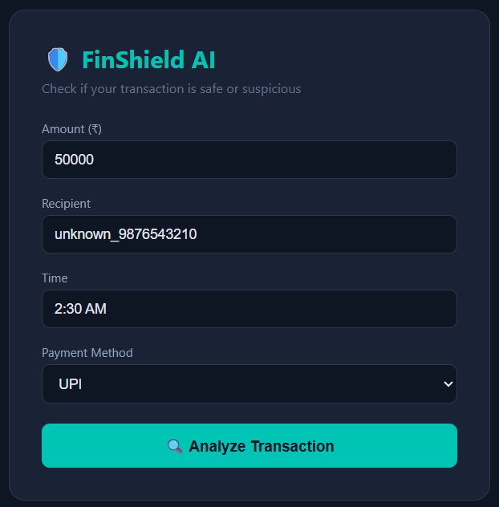

# 🛡️ FinShield AI

AI-powered fraud detection for Indian payment transactions.

## What it does
Send a transaction — AI instantly tells you SAFE or SUSPICIOUS in Hinglish.

## Example
**Input:**
- Amount: ₹50,000
- Recipient: unknown_9876543210
- Time: 2:30 AM
- Method: UPI

**Output:**
VERDICT: SUSPICIOUS
REASON: Raat ke 2:30 baje kisi unknown number par ₹50,000 transfer karna bohot bada risk hai.
ACTION: Turant apna UPI PIN badlo aur bank ko contact karo!

## Tech Stack
- Python + FastAPI
- Gemini AI
- python-dotenv

## How to run

1. Clone the repo
2. Install dependencies:
   pip install -r requirements.txt
3. Create .env file:
   GEMINI_API_KEY=your-key-here
4. Run server:
   uvicorn main:app --reload
5. Open: http://127.0.0.1:8000/docs

## Project
Part of FinShield AI Suite — 5 AI projects built in public.

## Web UI
Open `index.html` directly in your browser while server is running.

